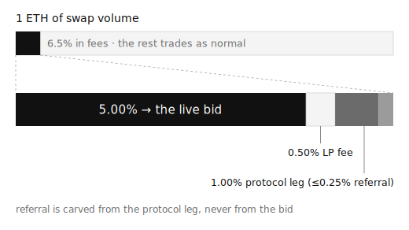

<!-- GENERATED by scripts/generate-docs.ts from _pages/ + app/lib/abis — do not edit this file directly. -->

# Overview

PERMANENT COLLECTION is an on-chain protocol on Ethereum mainnet that uses a
speculative ERC20 to build a permanent collection of CryptoPunks via
full-trait coverage. Every protocol contract is deployed, immutable, and
source-verified. The protocol has no deadline; it completes only when all 111
CryptoPunks traits are represented by vaulted Punks.

This reference documents the protocol the way an API is documented: every
contract, every function, every event, every error, with access control and
worked examples. Signatures are generated from the deployed contracts' ABIs,
so they can't drift from what's on chain.

## The loop

CryptoPunks have 111 distinct traits across 4 dimensions. The protocol's goal
is a collection that covers every trait.

In detail:

1. **The live bid.** [Patron](/docs/contracts/patron) holds a single global
   ETH bid, funded continuously by a 6% skim on $111 swap volume in the
   official pool. Any owner of an eligible Punk (one carrying an uncollected,
   not-pending trait) can accept it
2. **The return auction.** An accepted Punk enters a 72-hour auction on
   [ReturnAuctionModule](/docs/contracts/return-auction-module) with a reserve
   above the protocol's cost. Anyone can bid to return it to the market
3. **Two outcomes.** If a bid clears the reserve, the Punk goes to the bidder
   and the proceeds split three ways: 65% of cost refills the live bid, 25%
   buys and burns $111, 10% plus the premium accrues for later burns. If
   nobody bids, the Punk enters [PunkVault](/docs/contracts/punk-vault)
   permanently and exactly one trait, the recorded target, becomes collected
4. **The records.** [PermanentCollection](/docs/contracts/permanent-collection)
   records every acquisition and the monotonically growing `collectedMask`.
   The first vaulting of each trait mints a Proof NFT (token ids 0..110 on
   PunkVault) to the Punk's original seller

The recorded target trait is protocol-derived, not caller-chosen: always the
rarest uncollected, not-pending trait the Punk carries.

## Fee flow per 1 ETH of swap volume

The official pool's hook skims 6% of swap volume at swap time and routes it in
the same transaction:

| Leg | Share | Destination |
| --- | --- | --- |
| Live bid | 5.00% | [LiveBidAdapter](/docs/contracts/live-bid-adapter), metered into Patron |
| Protocol | 1.00% | [ProtocolFeePhaseAdapter](/docs/contracts/protocol-fee-phase-adapter), then 86.67% treasury / 13.33% LAYER burn |
| Referral | up to 0.25% | [ReferralPayout](/docs/contracts/referral-payout), deducted from the protocol leg when a swap carries attribution |

A separate 0.5% LP fee goes to in-range liquidity per standard Uniswap V4
mechanics. See [Skim hook](/docs/contracts/skim-hook) for the mechanism and
[Swap with referral attribution](/docs/guides/swap-with-attribution) for the
integration.

## How this reference is organized

- **Introduction** — this page, all [contract addresses](/docs/introduction/addresses),
  and the [conventions](/docs/introduction/conventions) the reference uses
- **Contracts** — one page per contract: role, concepts, then every write
  function, read function, event, and error
- **Guides** — task-oriented walkthroughs: accepting the live bid, bidding on
  a return auction, running a keeper, swapping with attribution
- **Off-chain** — the [indexer](/docs/offchain/indexer), the site's
  [REST endpoints](/docs/offchain/rest-api), and the
  [machine-readable surfaces](/docs/offchain/abis-and-manifest)
- **Reference** — cross-cutting indexes:
  [access control](/docs/reference/access-control),
  [errors](/docs/reference/errors), [events](/docs/reference/events)

For the conceptual and architectural layer behind this reference, see the
repo docs: `docs/SYSTEM.md` (system overview), `docs/PROTOCOL.md` (protocol
spec), `docs/SECURITY.md` (trust model), and `docs/COMPOSABILITY.md`
(builder integrations) at
[github.com/ripe0x/permanent-collection](https://github.com/ripe0x/permanent-collection).

## For AI agents

[AI agents](/docs/offchain/ai-agents) is the entry point for automated
consumers: recipes for reading protocol state, checking eligibility, finding
live auctions, watching events, and running keeper actions, each pointing at
the fuller reference.

The machine-readable surfaces it builds on:

- [`/protocol-manifest.json`](/protocol-manifest.json): every contract's
  address, ABI path, and reference page in one document
- `/abis/<ContractName>.json`: one plain ABI array per contract
- [`/llms.txt`](/llms.txt): a compact map of the whole reference
- [`/docs-search-index.json`](/docs-search-index.json): this reference as a
  retrieval corpus

All reads work against any Ethereum mainnet RPC; examples use
`https://ethereum-rpc.publicnode.com`.
